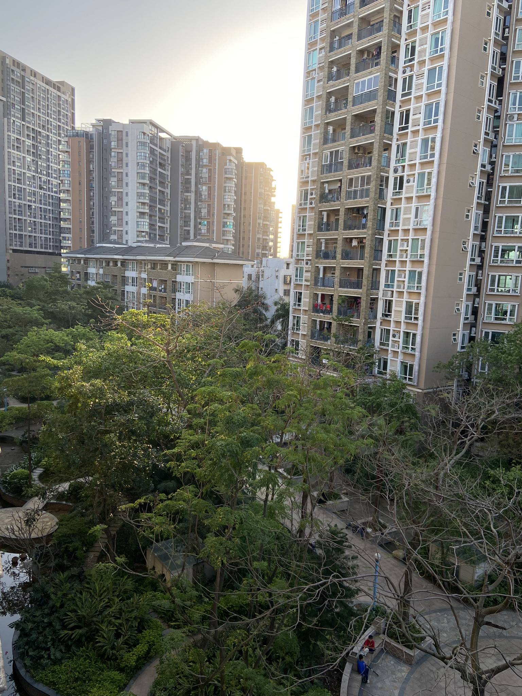

重新开始审视自己的过去，时间一天一天过去。好像得到了些什么，又好像什么都没有得到。

下午阳光明媚，想着看看之前的生活。好像没办法从记忆中提取。当下大家的记忆可能都在互联网上。看了一下之前自己的微博，觉得那时候的表达欲怎么这么强。记录生活是挺好的一件事情，现在好像都失去了。

可能需要再找回来呢。

网站搭建起来大半年了，一共也没发几篇博客。甚是惭愧。

4月

在技术上：给个简单的计划。或者是阅读个开源库的源码然后，或是记录一些算法，写够10篇技术博客吧。

在生活上：管住嘴，迈开腿。

人总是需要进步的。

最后，人生警句：知善恶，致良知。

